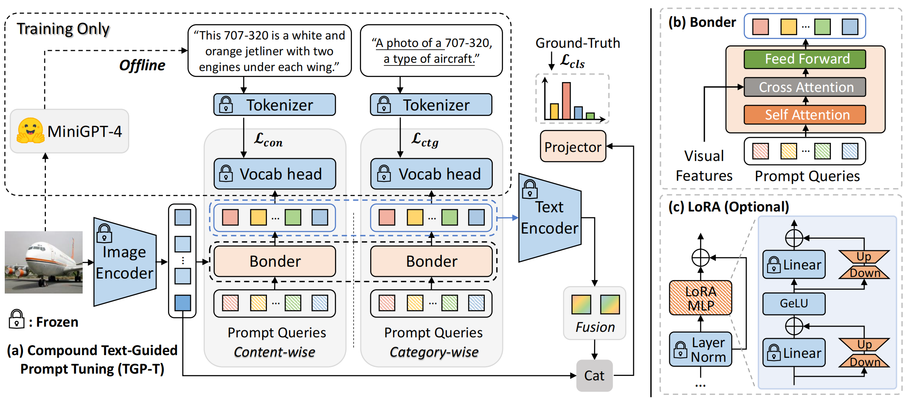

# TGP-T🚀: Compound Text-Guided Prompt Tuning via Image-Adaptive Cues

Official implementation of the paper in AAAI 2024:

**Compound Text-Guided Prompt Tuning via Image-Adaptive Cues**

[Hao Tan](https://scholar.google.com/citations?hl=zh-CN&user=gPEjNFcAAAAJ), [Jun Li](https://bazinga699.github.io/), [Yizhuang Zhou](https://scholar.google.com/citations?user=VRSGDDEAAAAJ), [Jun Wan](http://www.cbsr.ia.ac.cn/users/jwan/), [Zhen Lei](http://www.cbsr.ia.ac.cn/users/zlei/), [Xiangyu Zhang](https://scholar.google.com/citations?user=yuB-cfoAAAAJ)

[[PDF](https://arxiv.org/pdf/2312.06401.pdf)]

<p align="center">
    
</p>


## Introduction🧭

TGP-T is an efficient prompt tuning framework for adapting VLMs with significantly lower resource demand. We introduce compound text supervision to guide the optimization of prompts, i.e., category-wise and content-wise text supervision. Through a Bonder structure, we align the generated prompts with visual features. As a result, we only need two prompt inputs to text encoder to produce state-of-the-art performance on 11 datasets for few-shot classification.

<p align="center">
    
</p>


## Requirements📨

### Installation

We recommend to install the environment through `conda` and `pip`.

```bash
conda create -n tgpt python=3.8
conda activate tgpt

# Install the dependencies
pip install -r requirements.txt
```

### Dataset

Follow these steps to prepare the datasets: 

1. Image
- Please follow `data/DATASETS.md` to download the 11 datasets along with `ImageNetV2` and `ImageNet-Sketch`. 

2. Content descriptions

- Download all the content descriptions and preprocessed data files in [GoogleDrive](https://drive.google.com/file/d/1OA3lL9wJ8p7sGSm_JII_5RNyS_jwOlCM/view?usp=sharing) or [Baidu Netdisk](https://pan.baidu.com/s/1FeCS4A-_ai8LtMitrmeDLw?pwd=ky6d) (passward:ky6d).
- We provide the content descriptions generated by `MiniGPT-4` for all 11 datasets, namely `[dataset]/descriptions.txt`. 
- Each line in the `descriptions.txt` contains three elements separated by `\t`, i.e., image name, content description and category of the image.

3. Data organization
- Put them in the same directory. For example, the directory structure should look like:

```
imagenet/

|-- descriptions.txt

|-- images/

|   |-- train/ # contains 1,000 folders like n01440764, n01443537, etc.

|   |-- val/

|-- split_fewshot/

|   |-- shot_16-seed_1.pkl  # shot_16-seed_2.pkl, shot_8-seed_1.pkl, etc.
```

Before training, make sure you change the image paths in the `split_fewshot/shot_{x}-seed_{x}.pkl`. 

We provide `tools/convert_path.py`  to get this done. To trigger convertion for all datasets, you can run this simple command:

```shell
sh convert_path.sh [/root/path/to/your/data]

# For example
# sh convert_path.sh ./recognition/data
```


## Usage🧩

### 1. Configs

The running configurations can be modified in `configs/configs/dataset.yaml`, including number of shots, visual encoders, and hyperparamters.

For simplicity, we provide the hyperparamters achieving the overall best performance on 16 shots for a dataset, which is accord with the scores in our paper. If respectively tuned for different shot numbers, the 1~16-shot performance can be further improved. You can edit the `MAX_ITER`, `LR` for fine-grained tuning.

### 2. Running

#### Few-shot Recognition🎯

**Training.** To train on a specific dataset, all you need is `train.py` :

- Specify the dataset configs by `--config-file`
- Specify your path to the dataset by `--root`
- Specify the path where you want to save the results (inlcuding training logs and weights) by `--output-dir`
- You can turn on the logging on `wandb ` by enabling `--use-wandb`. To specify the project name of wandb, you can use `--wandb-proj [your-proj-name]`

For example, to run on ImageNet:

```shell
python train.py --config-file configs/configs/imagenet.yaml --use-wandb
```

**Reproduction.** We also provide an easy way `main.sh` to reproduce the results in our paper. This will trigger 16-shot training on all 11 datasets, including different seeds. To speed up the training, you can choose to parallel them on multiple GPUs.

```shell
sh main.sh
```

#### Distribution Shift🎯

To perform distribution shift experiments, all you need is `train_xdomain.py`. We take "Source" dataset as `ImageNet`, "Target" datasets as `ImageNet-V2` and `ImageNet-Sketch`. 

Running the following command will automatically load the weights you have trained on 16-shot ImageNet. If you haven't trained on ImageNet before, it will first start training and then evaluation.

```shell
python train_xdomain.py --use-wandb
```


## Discussion💬

To inject rich semantic knowledge into prompts, we take advantages of `MiniGPT-4` to generate the content descriptions. Here are some related discussions:

- In order to reduce noise from `MiniGPT-4`, i.e., focus on the target object rather than background information, we adjust the input prompts for `MiniGPT-4` and avoid the model from generating overly long sentences. After testing, we choose `Describe the {classname} in this image in one sentence.` as the final input prompts.
- `MiniGPT-4` is introduced only during the training phase and does not cause information leakage in the test phase. Actually, the enhancement brought to visual tasks by general knowledge of large models is indeed highly interesting. We also hope this work can inspire more resource-efficient ways on this.


## Citation

```
@article{tan2023compound,
  title={Compound Text-Guided Prompt Tuning via Image-Adaptive Cues},
  author={Tan, Hao and Li, Jun and Zhou, Yizhuang and Wan, Jun and Lei, Zhen and Zhang, Xiangyu},
  journal={arXiv preprint arXiv:2312.06401},
  year={2023}
}
```


## Acknowledgements

This repo benefits from [CLIP](https://github.com/openai/CLIP), [CoOp](https://github.com/KaiyangZhou/Dassl.pytorch) and [Cross-Modal Adaptation](https://github.com/linzhiqiu/cross_modal_adaptation). Thanks for their wonderful works.
